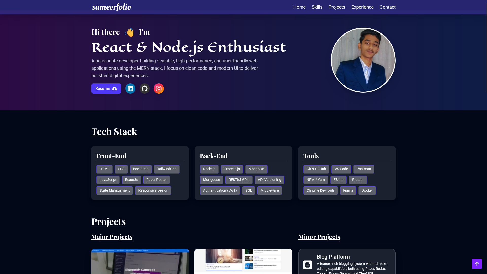

# Sameerfolio


## Overview
This is a personal developer portfolio built to showcase my skills, projects, education, and contact details in a clean and modern interface. It highlights who I am, what I’ve built, and how to get in touch — all in one smooth, responsive, and interactive web application.

## Features
- Responsive design optimized for all devices
- Smooth scrolling navigation
- project showcase section
- Skills and technology stack presentation
- Educational background timeline
- Contact form for easy communication
- Professional and modern UI


## Technologies Used

- **Frontend:** React.js
- **Styling:** Tailwind CSS
- **Icons:** React Icons
- **Fonts:** Google Fonts 
- **Routing:** Scroll-smooth navigation
- **Components:** Modular and reusable structure


## Installation
To set up the project locally, follow these steps:

1. **Clone the repository**

```bash
git clone https://github.com/ma3llim007/sameerfolio.git
cd your-portfolio
```

2. **Install dependencies**

```bash
yarn install
```

3. **Start the development server**

```bash
yarn run dev
```

The app will be available at `http://localhost:5173`.

## Usage

- Customize the `components` folder to update personal content.
- Replace the `Hero`, `Skills`, `Project`, `Education`, and `Contact` sections with your own data.
- Update the styles or color schemes in `index.css` as needed.

## Development & Contribution

If you want to contribute, fix a bug, or add a feature, you’re welcome to open a pull request.

1. Fork the repository
2. Create your feature branch: `git checkout -b feature/your-feature-name`
3. Commit your changes: `git commit -m "Added some feature"`
4. Push to the branch: `git push origin feature/your-feature-name`
5. Open a Pull Request

## Contribution Guidelines

- Keep code clean and well-commented
- Follow the existing project structure
- Test changes before pushing
- Provide a clear and concise PR message

## License

This project is licensed under the MIT License - see the [LICENSE](LICENSE) file for details.

## Acknowledgements
- React.js: For building dynamic and efficient user interfaces
- TailwindCSS: For utility-first, responsive, and clean styling
- React Icons: For easily integrating scalable icons
- Google Fonts: For clean and modern typography
- Vite: For blazing-fast development environment
- Scroll-smooth & Component-based architecture: For intuitive navigation and modularity